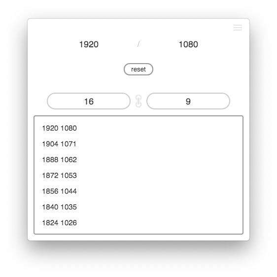

⚠️ [This project now has an online version!](https://topheranselmo.com/tools/ratiomatic)

<h1 align="center">ratiomatic</h1>
<p align="center">A handy tray tool for working with ratios, for Mac</p>
<p align="center">
  
</p>

When designing UI for various applications, I often found myself needing to figure out various whole-number scaled values for given proportions. I made this tool to satisfy that need. It allows you to enter a ratio (i.e. 1920/1080) and it will provide you with every whole number simplification of that proportion. In addition, you can input new numbers to get the approapriate numerator/denominator to go with it based on the original ratio.

Also it works with MacOS dark theme ¯\\\_(ツ)\_/¯

Thanks to [sanboxrunner](https://github.com/sanboxrunner) for writing the proportion simplification logic.

## Download
Download the latest release [here](https://github.com/christopherwk210/ratiomatic/releases).

## Development
After forking/cloning:
```
$ npm install
$ npm start
```

To make a build:
```
$ npm run build
```

## License
MIT
